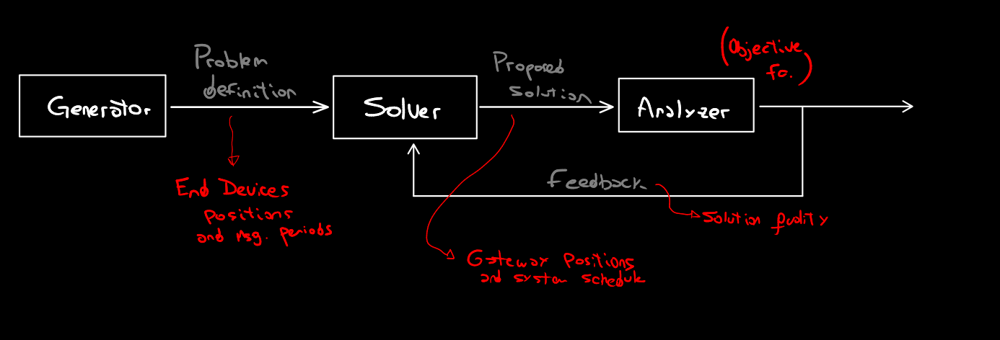
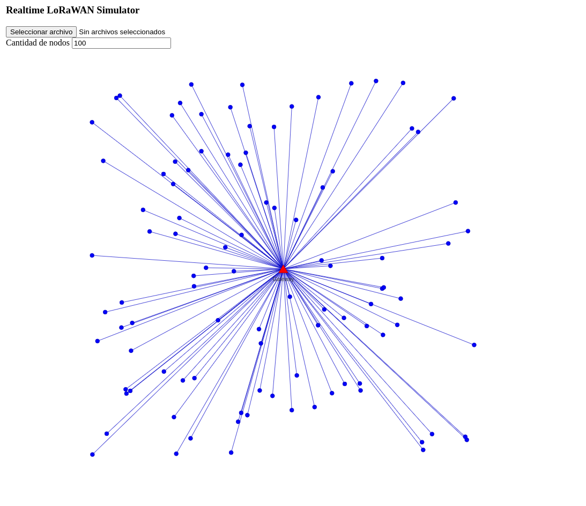

# Real-time LoRaWAN Simulator

A tool for generate, analyze and visualize city-wide, real-time LoRaWAN networks composed of a few thousand to millions end devices. 





# Getting started

### Install
```bash
git clone https://github.com/matiasmicheletto/realtime-lorawan-simulator
cd realtime-lorawan-simulator
npm install
```

### Use live (development) version
```bash
npm run dev
```

### Compile optimized version
```bash
npm run build
serve dist
```

