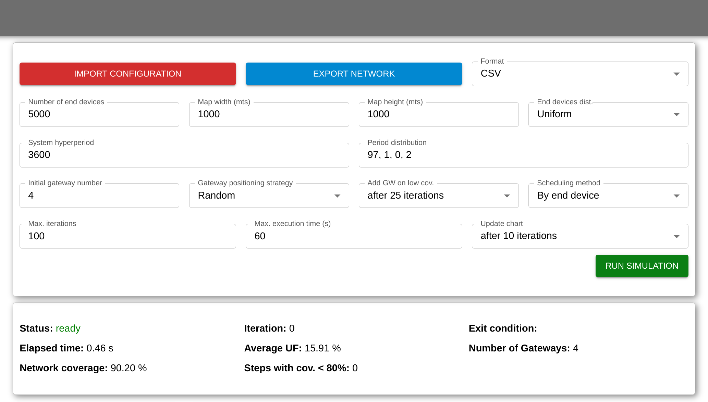

# Real-time LoRaWAN Simulator & Optimizer

A tool for generate, analyze and visualize city-wide, real-time LoRaWAN network model composed of a few thousand to millions end devices. 

Using this application, we can test different algorithms to determine the minimum number of gateways and their positions in order to connect the entire list of end devices.

Each end device has to transmit a single periodic message to a gateway from a fixed position and the locations and periods of all end devices in the network can be loaded from an external file or be randomly generated. 
The goal is to determine where to locate the gateways in order to achieve a fully connected network. The conditions to be fulfilled for an end device to be connected to a gateway are the following:

  - The gateways and end devices can be connected through one of 16 different and orthogonal channels. 
  - The gateways and end devices can be connected using one of six different and orthogonal spreading factors. 
  - Each spreading factor has its maximum range and minimum transmission period, wich are listed below:
    - SF7: max range is 62.5m and min period is 100 slots.
    - SF8: max range is 125m and min period is 200 slots.
    - SF9: max range is 250m and min period is 400 slots.
    - SF10: max range is 500m and min period is 800 slots.
    - SF11: max range is 1000m and min period is 1600 slots.
    - SF12: max range is 2000m and min period is 3200 slots.

The javascript library allows to define the initial conditions and add or move gateways to test the resulting coverage. An heuristic method is provided to iteratively minimize the number of gateways and determine their optimal positions.





### Adaptive model
This strategy allows to minimize the number of Gateways to reach a 100% coverage of the end devices. The model consist on moving the gateways as if they were attracted to not connected end devices.


# Getting started

## Installation
```bash
git clone https://github.com/matiasmicheletto/realtime-lorawan-simulator
cd realtime-lorawan-simulator
npm install
```


## JS scripting tool
The library can be used with NodeJs. The [examples](lora-network-model/examples) folder contain different demonstrations.
```js
import Manager from '/lora-network-model/model-manager';
const parameters = {
    N: 500,
    H: 3600,
    mapWidth: 1000, 
    mapHeight: 1000,
    posDistr: "uniform",
    periodsDistr: "97, 1, 0, 2", // 97% -> 3600, 1% -> 1800, 0% -> 1200, 2% -> 900
    initialGW: 2,
    strategy: "random",
    maxIter: 100,
    maxRuntime: 60
};
const manager = new Manager(parameters);
manager.initialize();
manager.run().then(results => console.log(results))
```

## GUI

### Use live (development) version
```bash
npm run dev
```

### Compile optimized version
```bash
npm run build
serve dist
```
